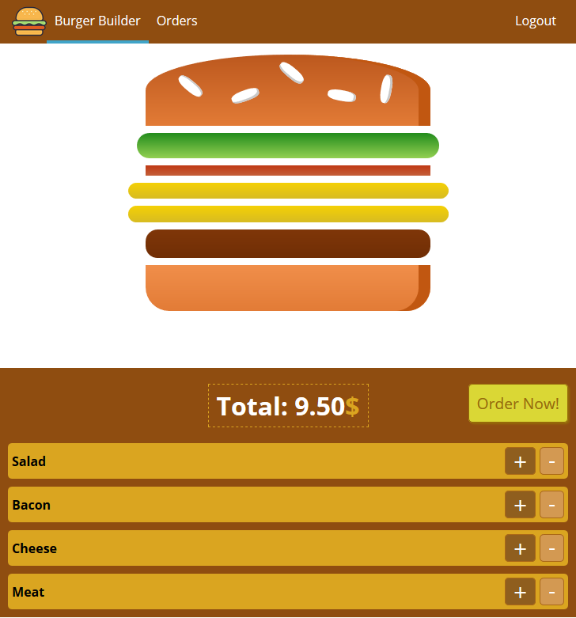

# React Course

This is the Repository of the [React Course](https://www.udemy.com/course/react-the-complete-guide-incl-redux) with all its lessons saved as
commits. This is also the repository of the course project, the [Burger Builder](https://du-react-burger-builder.web.app/).

## React Features learned in this Course

* Components (Functional and Class based)
* Styling Components (Radium, Styled Components and CSS Modules)
* Lifecycle methods
* Modules
* HTTP Requests and Interceptors with Axios
* Router
* Forms and Validation
* Redux and Asynchronous Code with Redux-Thunk

## Sections

The lessons will be organized as commits, for instance

"Section 2: The Basics"

```txt
  "[Section 'number'] : [lesson name]"
```

## Big Burger App



## Author

* **Eduardo Lima** - du-almeidalima
